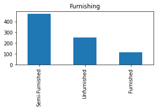
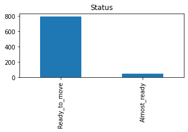
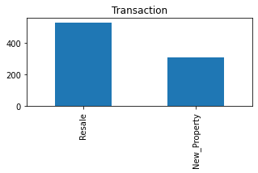
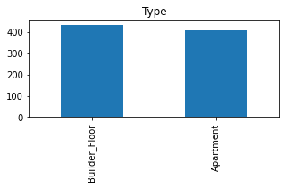
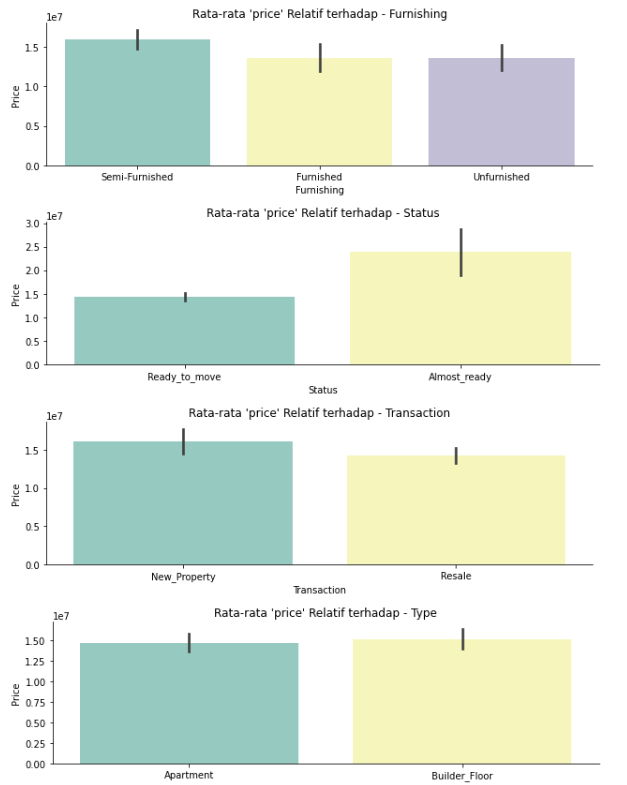
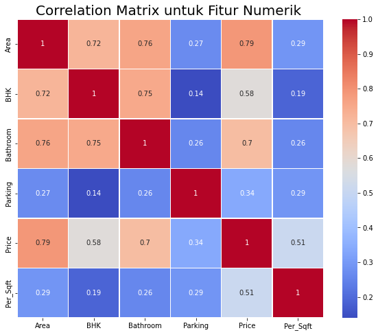
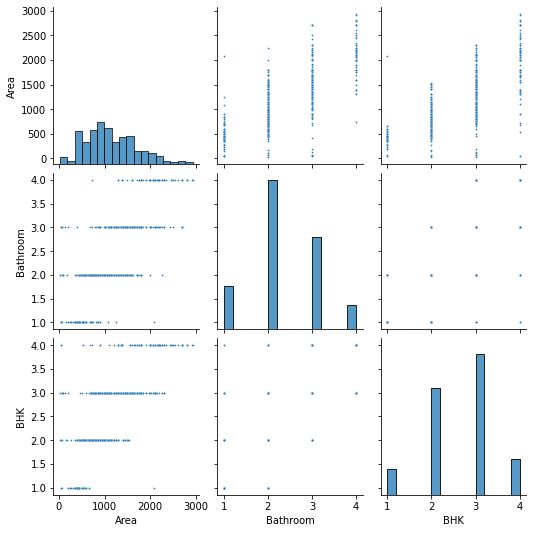

# Laporan Proyek *machine learning* - Sawitri Fina Kartika
 
## Domain Proyek
 
Di zaman sekarang ini, sulit untuk memprediksi harga rumah. Ada banyak variabel yang mempengaruhi harganya. Masyarakat kesulitan mengetahui harga rumah ketika setiap rumah memiliki kondisi yang berbeda-beda. Umumnya orang ingin membeli rumah yang sesuai dengan harganya. Tapi mereka tidak tahu seberapa besar kondisi rumah tertentu mempengaruhi harganya. Bagi para penjual, mereka tidak ingin menjual rumahnya dengan harga di bawah rata-rata. Jadi, mereka harus bisa memprediksi harga rumah secara akurat agar bisa mendapatkan atau memberikan harga terbaik. Memprediksi harga rumah secara akurat bisa menjadi tugas yang menakutkan. Pembeli hanya tidak peduli dengan ukuran (kaki persegi) rumah dan ada berbagai faktor lain yang memainkan peran kunci untuk menentukan harga rumah/properti.
 
Melihat permasalahan ini membuat saya ingin mengembangkan sebuah proyek berbasis Ekonomi Bisnis yang dapat membantu orang orang dalam melakukan penjualan maupun pembelian rumah dengan harga yang sesuai. Dalam mengembangkan proyek ini pemilihan metode regresi merupakan solusi yang ditawarkan dimana dalam menyelesaikan permasalahan ini membandingkan 3 algoritma yang sesuai yaitu KNN, Random Forest dan Boosting. Berikut ini merupakan referensi dalam penyelesaian permasalahan kasus ini  [House Price Prediction Modeling Using *machine learning*]( template.doc (mecs-press.org))
 
## Business Understanding
 
### Problem Statements
- Dari serangkaian fitur yang ada, fitur apa yang paling berpengaruh terhadap harga jual rumah?
- Berapa harga rumah dengan karakteristik tertentu?
 
### Goals
- Mengetahui fitur yang paling berkorelasi dengan harga penjualan rumah.
- Membuat model *machine learning* yang dapat memprediksi harga rumah seakurat mungkin berdasarkan fitur-fitur yang ada.
 
### Solution statements
1.  Melakukan Elskpolari pada Dataset yaitu Exploratory Data Analysis
2.  Mencari korelasi antar fitur yang memiliki korelasi yang paling dekat dengan fitur price
3.  Menghapus fitur yang tidak memiliki korelasi yang lemah terhadap fitur price dalam kondisi ini yang nilainya dibawah 0.0 (Dapat dilihat pada tabel korelasi)
4.  Membagi data menjadi data training dan data set dengan perbandingan 8:2
5.  Melakukan Standarisasi pada data training agar memiliki nilai yang hampir sama sehingga mudah dalam melakukan pemrosesan.
6.  Melakukan uji data dengan menerapkan tiga algoritma untuk dilakukan perbandingan mana yang lebih baik dalam hal ini menggunakan KNN, Random Forest, dan Boosting*
7.  Melakukan Uji test data dengan melakukan Standarisasi pada data test (dalam hal ini pemisahan standarisasi dilakukan secara terpisah antara train dan test agar menghindari kebocoran data) kemudian melakukan uji testing pada data.
8.  Mendapatkan hasil prediksi model yang paling akurat di antara ketiga model
 
## Data Understanding
Pada pengembangan sistem prediksi harga rumah ini menggunakan sebuah data penjualan rumah dari [Delhi house data](https://www.kaggle.com/datasets/saipavansaketh/pune-house-data?select=Delhi+house+data.csv). Terdapat 11 kolom dan 1259 entry dengan variabel dan fitur yang ada.
 
### Variabel-variabel pada Restaurant UCI dataset adalah sebagai berikut:
- Area: merupakan luas Properti dalam kaki persegi
- BHK: merupakan jumlah Kamar Tidur bersama dengan 1 Aula dan 1 dapur
- Bathroom: merupakan jumlah kamar mandi
- Furnishing: merupakan klasifikasi apakah properti yang terdaftar dilengkapi perabotan, tanpa perabotan, atau semi furnished
- Locality: merupakan lokalitas di mana properti berada
- Parking : merupakan ada tidaknya parkir pada lokasi tersebut.
- Price : merupakan Harga properti di INR
- Status : merupakan status properti seperti 'siap pindah' atau masih dalam pembangunan
- Transaction : merupakan jenis yang membagi antara properti baru atau dijual kembali
- Type : merupakan jenis rumah seperti apartemen atau lantai pembangun
- Per_Sqft: merupakan ukuran per kaki persegi lantai..
 
### Univariate Analisis
 
Pada univariate Analisis terdapat beberapa data yang dilakukan analisis dengan menjelaskan beberapa gambar.
 

 
Gambar diatas menunjukkan properti lebih banyak memakai tipe yang telah setengah berfuniture dibandingkan tipe yang berfuniture. Persentase pada gambar tersebut adalah 56,1 : 30,2 : 13,7
 

 
Gambar diatas menunjukkan properti lebih banyak berstatus 'siap' dibandingkan 'masih dalam pengembangan'. Persentase gambar tersebut adalah 94,4 : 5,6.
 

 
Gambar diatas menunjukkan properti lebih banyak yang ditransaksikan dengan menjual kembali daripada properti baru. persentase gambar tersebut adalah 63,1 : 36,9.
 

 
Gambar diatas menunjukkan properti lebih banyak bertipe bangunan berlantai dibanding apartemen. persentase pada gambar tersebut adalah 51,5 : 48,5.
 
### Multivariate Analysis
 
Pada multivariate analysis mengidentifikasikan rata-rata relatif dari harga dengan beberapa fitur yang ditunjukkan pada gambar.
 

Gambar diatas menunjukkan bahwa diagram pertama harga pada properti setengah berfurnitur paling tinggi dibanding tidak berfurnitur. Kemudian pada diagram kedua harga pada properti status dalam pembangunan paling tinggi dibanding properti yang siap. Diagram ketiga, harga properti baru paling tinggi dibanding properti yang dijual kembali. Diagram terakhir, harga properti tipe bangunan lebih tinggi dibandingkan apartemen.
 
### Correlation Matrix
 

Pada correlation matrix dapat diambil kesimpulan dimana fungsi target 'Price', nilai korelasi terlemah jatuh pada 'Parking'. Sehingga data parking tidak diperlukan dalam melakukan prediksi. Dimana nilai korelasi 'Parking sebesar 0,34.
 
 
## Data Preparation
 
Sebelum dilakukan pembagian data, terdapat beberapa kategori pada kolom yang perlu dilakukannya encoding dengan library OneHotEncoder. Kemudian dilakukan reduksi menggunakan PCA untuk mengetahui nilai dimensinya.
 
Fungsi OneHotEncoder berfungsi untuk mendapatkan fitur baru yang sesuai sehingga dapat mewakili variabel kategori.Sedangkan PCA adalah teknik untuk mereduksi dimensi, mengekstraksi fitur, dan mentransformasi data dari “n-dimensional space” ke dalam sistem berkoordinat baru dengan dimensi m, dimana m lebih kecil dari n.
 

<!-- Coba -->
 
Akan dilakukan reduksi fitur (dimensi) dan hanya mempertahankan PC (komponen) pertama saja. PC pertama ini akan menjadi fitur dimensi menggantikan ketiga fitur lainnya ('Area','Bathroom', 'BHK'). Kita beri nama fitur ini 'dimension'. Dimana menggunakan 1 komponen dengan random sebanyak 123 kali.
 
Pada Data Preparation dalam mengembangkan model ini menggunakan salah satu metode pengembangan yaitu Train-Test-Split. Train-Test-Split merupakan metode untuk membagi data menjadi data training dan data test dimana pada pengngembangan model ini menggunkan pembagian data sebesar 80% data training dan 20% data Test. Pemilihan penggunaan metode ini karena untuk membagi data menjadi data training dan data test agar model dapat melakukan training yang baik dan test dengan rasio 8:2. Dimana akan menggunakan seluruh fitur selain 'Price' sebagai pembanding dengan melakukan drop kolom atau menghapus kolom serta menggunakan fitur 'price' sebagai target. Setelah itu akan dilakukan standarisasi pada fitur bernumerik seperti pada fitur 'Per_Sqft'
 
Selain itu dalam melakukan data processing dilakukan pula proses Standardization dimana tujuannya dilakukan proses ini karena. Algoritma *machine learning* memiliki performa lebih baik dan konvergen lebih cepat ketika dimodelkan pada data dengan skala relatif sama atau mendekati distribusi normal. Proses scaling dan standarisasi membantu untuk membuat fitur data menjadi bentuk yang lebih mudah diolah oleh algoritma. Dalam menerapkan metode ini pula dilakukan dua kali proses yaitu saat data training dan saat data testing tujuannya untuk menghindari kebocoran data.
 
 
## Modeling
Pada tahap pengembangan model *machine learning* ini dalam membuat modelnya dilakukan tahapan menggunakan tiga model algoritma yang kemudian dilakukan perbandingan dan memilih algoritma terbaik yang akan dilakukan pengembangan :
 
- KNN Algorithm
Algoritma KNN menggunakan ‘kesamaan fitur’ untuk memprediksi nilai dari setiap data yang baru. KNN bekerja dengan membandingkan jarak satu sampel ke sampel pelatihan lain dengan memilih sejumlah k tetangga terdekat (dengan k adalah sebuah angka positif). KNN memiliki parameter n_neighbors yang berarti algoritma menemukan n titik terdekat dan mengklasifikasikan titik baru berdasarkan mayoritas dari n titik tersebut. Algoritma K-NN mengasumsikan kesamaan antara kasus/data baru dan kasus yang tersedia dan memasukkan kasus baru ke dalam kategori yang paling mirip dengan kategori yang tersedia.Pada proyek ini diguna library KNeighborsRegressor untuk KNN dengan n=10 dan metric Euclidean untuk mengukur jarak antara titik. Nilai set 10 akan membuat hasil prediksi lebih halus karena memiliki variasi pengelompokan yang lebih banyak.
- Random Forest Algorithm
Algoritma decision tree adalah teknik dengan memilih sejumlah fitur dan sejumlah sampel secara acak dari dataset yang terdiri dari n fitur dan m sampel. Parameter n_estimator mengontrol jumlah pohon di dalam pengklasifikasi, max_depth mengatur ketinggian maksimum hingga pohon-pohon di dalam hutan dapat tumbuh, random_state menentukan opsi yang digunakan untuk mengacak data input, dan n_jobs adalah jumlah prosesor yang dapat digunakan untuk pelatihan dimana -1 adalah tanpa batas. Saat menggunakan Random Forest untuk klasifikasi, setiap pohon memberikan klasifikasi atau vote. Hutan memilih klasifikasi dengan mayoritas vote. Saat menggunakan Random Forest untuk regresi, hutan memilih rata-rata output dari semua pohon. Proyek ini menggunakan library RandomForestRegressor pada random forst dengan n_estimator sebanyak 50 artinya pada penerapan prosesnya dilakukan sebanyak 50 semakin banyak yang digunakan maka hasilnya akan semakin baik tetapi akan akan membuat proses running semakin lambat.
- Boosting Algorithm
Algoritma ini bertujuan untuk meningkatkan performa atau akurasi prediksi dengan menggabungkan beberapa model sederhana dan dianggap lemah sehingga membentuk suatu model yang kuat. Parameter learning_rate merupakan penyusutan ukuran langkah yang digunakan dalam pembaruan untuk mencegah overfitting sedangkan random_state menentukan opsi yang digunakan untuk mengacak data input. Cara kerja adalah memperhatikan semua model yang telah dilatih, jika ada kesalahan prediksi lakukan perbaikan model sebelumnya secara berurutan agar meningkatkan akurasi menggunakan library AdaBoostRegressor
 
Berdasarkan hasil perbandingan ketiga model algoritma diatas hasil terbaik diperlihatkan oleh model algoritma Random Forest dimana model errornya lebih sedikit dan pada proses testing model yang mendekati hasilnya ialah random forest.
 
## Evaluation
Pada tahap ini menggunakan metrik mse, mse melakukan perhitungan selisih rata rata sebenarnya dengan nilai prediksi. pada dasarnya setiap metrik melakukan hal yang sama yaitu jika prediksi mendekati nilai sebenarnya, performanya baik. Sedangkan jika tidak, performanya buruk. Secara teknis, selisih antara nilai sebenarnya dan nilai prediksi disebut eror. Dari analisa ketiga algoritma, algoritma terbaik adalah algoritma Random Forest.
 

 
Nilai | KNN | RF | Boost
--- | --- | --- | ---
3300000 | 2775000.0 | 3188333.3 | 3624778.8
 
Dalam menerapkan metrik ini pada model sebelum melakukan test data hal yang dilakukan pertama ialah melakukan standardization pada data test agar hasil data test dan data training memiliki nilai yang sama selain itu dengan menerapkan standardization membantu mengurangi kebocoran data. Setelah dilakukan test data didapatkan hasil nilai test yang diberikan sebesar 3300000, model memberikan nilai yang mendekati yaitu pada RF sebesar 3188333.3, model KNN memiliki nilai terjauh yaitu sebesar 2775000.0, model Boosting merupakan alternatif model kedua setelah RF dengan nilai 3624778.8
 
 
 
 

